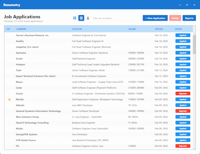
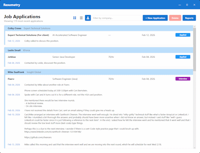
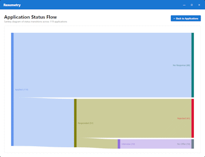

## Project Overview
Resumetry-net is a .NET 10 desktop WPF application that utilizes SQLite for local storage. 
It is meant to be more convienient, and free (no hosting costs), by running on your local desktop.

## Prerequisites
- VsCode or Visual Studio or just a .Net compiler (I haven't made an installer yet).

## What it does

- Track Job Applications that are submitted to companies.

[](assets/application-list.png)

- Switch to Recruiter view to track Jobs and conversations with recuiters.

[](assets/recruiter-view.png)

- Track Notes and Status changes that occur over time (Applied, Rejected, Screen, Interview, Offer, Withdrawl, NoOffer).

[](assets/application-form.png)

- Sankey report showing application status flow.

[](assets/sankey.png)

### Application Structure

Resumetry-net was built using Clean Architecture patterns.

```
Resumetry.slnx
├── Resumetry.Domain/              # Core business entities
│   ├── Interfaces/
│   ├── Entities/
│   ├── Enums/
│   └── Common/
│
├── Resumetry.Application/         # Application logic & use cases
│   ├── Interfaces/
│   ├── Services/
│   ├── Enums/
│   └── DTOs/
│
├── Resumetry.Infrastructure/      # Data access & external concerns
│   ├── Data/
│   │   ├── Repositories/
│   │   └── Configurations/
│   ├── Migrations/
│   └── Services/
│
└── Resumetry.WPF/                 # Presentation layer
    ├── Views/
    ├── ViewModels/
    ├── Styles/
    ├── Services/
    ├── Converters/
    ├── Controls/
    ├── Messages/
    └── App.xaml.cs                # DI container setup 
```
